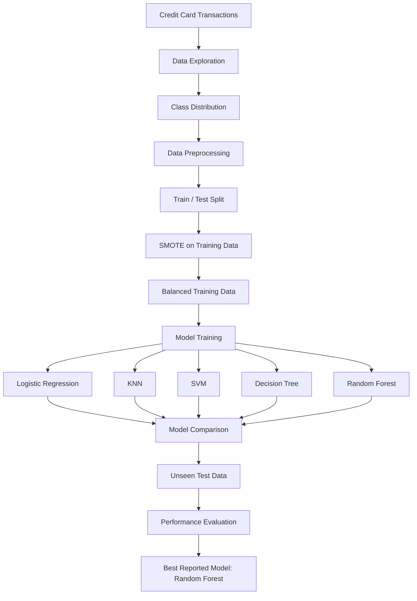
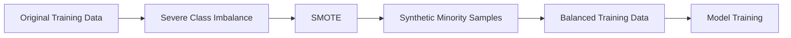
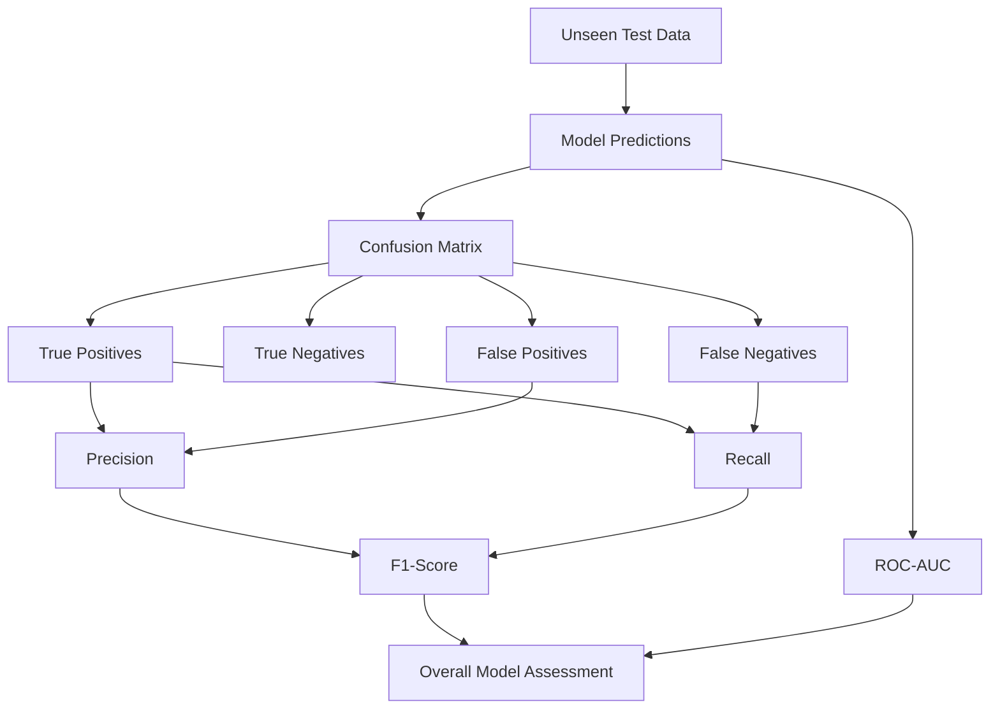

# Credit Card Fraud Detection Using Machine Learning


### Repository Link : https://github.com/swastik-sai/Credit-Card-Fraud-Detection-Using-Machine-Learning.git

This project develops a **machine learning-based fraud detection system** for identifying fraudulent credit card transactions in a severely imbalanced dataset.

The analysis focuses on handling the minority fraud class with **SMOTE**, comparing multiple classification algorithms, and evaluating performance using fraud-focused metrics such as **precision, recall, F1-score, ROC-AUC, and confusion matrix**.

---

## ⚡ Executive Performance Highlights

- 💳 Analyzed **284,807 credit card transactions**
- ⚠️ Addressed a severe **~0.17% fraud-to-total transaction ratio**
- 🔄 Applied **SMOTE** to oversample the minority fraud class in the training data
- 🤖 Compared **Logistic Regression, KNN, SVM, Decision Tree, and Random Forest**
- 🎯 **Random Forest achieved 94.3% precision**
- 🏆 **Random Forest achieved the highest F1-score of 93.6%**
- 📊 Evaluated generalization on **unseen test data** using ROC-AUC, confusion matrix, precision, recall, and F1-score

---

## 🏗️ Fraud Detection Architecture



---

## 📊 Dataset

The project uses an anonymized credit card transaction dataset containing **284,807 transactions** and **492 fraudulent transactions**.

| Attribute | Description |
|---|---|
| Total Transactions | **284,807** |
| Fraudulent Transactions | **492** |
| Legitimate Transactions | **284,315** |
| Fraud Ratio | **~0.17%** |
| Features | 30 input features |
| Target | `Class` |

The dataset contains:

- `Time` — elapsed time between transactions
- `Amount` — transaction amount
- `V1`–`V28` — anonymized numerical features
- `Class` — target variable (`0` = legitimate, `1` = fraudulent)

The anonymized `V1`–`V28` variables are treated as numerical predictors, while `Class` is used as the classification target.

---

## 🔬 Methodology

### 1. Data Exploration

Initial exploratory analysis examines:

- Dataset dimensions and feature types
- Missing values
- Class distribution
- Legitimate vs fraudulent transactions
- Transaction amount distributions
- Relationships between features and fraud labels

The severe class imbalance makes conventional accuracy an unreliable standalone measure.

### 2. Data Preprocessing

The dataset is prepared through:

- Feature-target separation
- Train-test splitting
- Numerical feature preparation
- Scaling where required by the classifier
- Separation of training and unseen test data

The imbalance-handling procedure is applied to the training data so that the test set remains representative of unseen transactions.

### 3. SMOTE for Class Imbalance

Fraudulent transactions account for only approximately **0.17%** of the dataset. A classifier trained directly on this distribution can become heavily biased toward the legitimate class.

**SMOTE (Synthetic Minority Over-sampling Technique)** is applied to the training data to generate synthetic minority-class observations.



SMOTE is applied **only to the training data**, preserving the original class distribution of the unseen test data for evaluation.

---

## 🤖 Machine Learning Models

The following classifiers are evaluated:

- **Logistic Regression**
- **K-Nearest Neighbors (KNN)**
- **Support Vector Machine (SVM)**
- **Decision Tree**
- **Random Forest**

The models are compared using metrics that reflect the actual objectives of fraud detection rather than accuracy alone.

---

## 📐 Evaluation Metrics

### Precision

Precision measures the proportion of transactions predicted as fraudulent that are actually fraudulent.

$$
Precision = \frac{TP}{TP + FP}
$$

### Recall

Recall measures the proportion of actual fraudulent transactions correctly identified.

$$
Recall = \frac{TP}{TP + FN}
$$

### F1-Score

F1-score is the harmonic mean of precision and recall.

$$
F1 = 2 \times \frac{Precision \times Recall}{Precision + Recall}
$$

Equivalently:

$$
F1 = \frac{2TP}{2TP + FP + FN}
$$

### ROC-AUC

ROC-AUC measures the model's ability to distinguish between legitimate and fraudulent transactions across classification thresholds.

### Confusion Matrix

The confusion matrix provides counts of:

- True Positives (TP)
- True Negatives (TN)
- False Positives (FP)
- False Negatives (FN)

---

## 📊 Model Results

### Best Reported Performance

| Metric | Random Forest |
|---|---:|
| **Precision** | **94.3%** |
| **F1-Score** | **93.6%** |

### Key Finding

**Random Forest achieved the highest reported F1-score of 93.6% on the test data**, making it the strongest reported model among the evaluated approaches.

The model also achieved **94.3% precision**, indicating that the majority of transactions flagged as fraudulent were genuinely fraudulent.

---

## 🔍 Model Evaluation Workflow



---

## 🚨 Error Analysis

Fraud detection requires understanding the consequences of different classification errors.

### False Positives

Legitimate transactions incorrectly classified as fraudulent.

**Business impact:** unnecessary transaction declines, customer friction, and additional verification.

### False Negatives

Fraudulent transactions incorrectly classified as legitimate.

**Business impact:** missed fraud, financial losses, and increased exposure.

### True Positives

Fraudulent transactions correctly identified by the model.

### True Negatives

Legitimate transactions correctly classified as legitimate.

The confusion matrix is used to examine these outcomes and understand the precision-recall trade-off.

---

## ⚠️ Why Accuracy Alone Is Not Enough

With only around **0.17% fraudulent transactions**, a classifier could achieve very high accuracy simply by predicting most transactions as legitimate.

For a binary classification problem:

$$
Accuracy = \frac{TP + TN}{TP + TN + FP + FN}
$$

A high accuracy score can therefore hide poor fraud detection performance when the minority class is extremely small.

The project consequently prioritizes:

- **Precision**
- **Recall**
- **F1-score**
- **ROC-AUC**
- **Confusion Matrix**

These metrics provide a more meaningful assessment of the ability to detect fraud while controlling false alerts.

---

## ⚙️ Requirements

The project uses:

- Python 3.x
- Jupyter Notebook
- Pandas
- NumPy
- Matplotlib
- Seaborn
- Scikit-learn
- imbalanced-learn

### Install dependencies

```bash
pip install pandas numpy matplotlib seaborn scikit-learn imbalanced-learn jupyter
```

---

## ▶️ Running the Analysis

The model implementations are organized into notebooks for the evaluated classifiers.

Run the notebooks to reproduce:

1. Data exploration
2. Class imbalance analysis
3. Data preprocessing
4. SMOTE-based training preparation
5. Model training
6. Model comparison
7. Test-set evaluation
8. Confusion matrix and classification metrics

The notebooks are located under:

```text
Code/
```

---

## 🛠️ Technologies Used

| Area | Technologies |
|---|---|
| Programming | **Python** |
| Data Manipulation | **Pandas, NumPy** |
| Visualization | **Matplotlib, Seaborn** |
| Machine Learning | **Scikit-learn** |
| Imbalanced Learning | **imbalanced-learn / SMOTE** |
| Models | Logistic Regression, KNN, SVM, Decision Tree, Random Forest |
| Evaluation | ROC-AUC, Confusion Matrix, Precision, Recall, F1-Score |
| Development | **Jupyter Notebook / Google Colab** |

---

## 📂 Project Structure

```text
Credit-Card-Fraud-Detection/
│
├── Code/
│   ├── Credit Card Fraud Detection - Logistic Regression.ipynb
│   ├── Credit Card Fraud Detection - K-Nearest Neighbor.ipynb
│   ├── Credit Card Fraud Detection - Support Vector Machines.ipynb
│   └── Credit Card Fraud Detection - Decision Tree.ipynb
│
├── Model/
│   ├── Model.docx
│   └── Machine_Learning_Project.pdf
│
├── Presentation/
│   └── AI-Report-Presentation.pptx
│
├── Project Proposal/
│   └── Project proposal documents
│
├── Report/
│   └── Project report
│
└── README.md
```

---

## 🎯 Key Takeaways

- Built a machine learning pipeline for **credit card fraud detection** on a severely imbalanced dataset.
- Addressed the **~0.17% fraud-to-total transaction imbalance** using **SMOTE**.
- Compared Logistic Regression, KNN, SVM, Decision Tree, and Random Forest.
- **Random Forest achieved 94.3% precision** on the reported test evaluation.
- **Random Forest achieved the highest reported F1-score of 93.6%**.
- Evaluated model performance using **ROC-AUC, confusion matrix, precision, recall, and F1-score**.
- Focused on the precision-recall trade-off rather than relying on accuracy alone.
